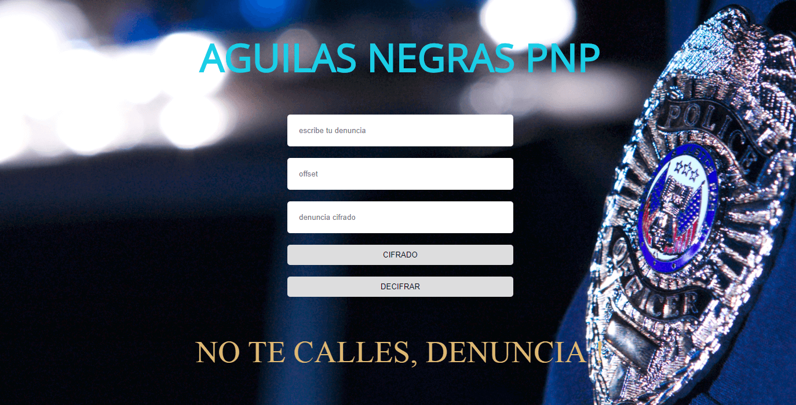

# Águila Negra PNP

En los últimos tiempos escuchaste en las noticias sobre la corrupción, sobre los lavados de activos y corrupción dentro del gobierno. Si alguien dice algo, le amenazan de muerte, sus familiares son amenazados o buscan la forma de desacreditar a la persona. 

Debido a este gran problema, decidimos crear esta aplicación que te permitirá enviar mensajes cifrados a la policía para que ellos tengan conocimiento y puedan empezar con una investigación. 

**Objetivos**:

* Que las personas que entren al gobierno y quieran luchar contra la corrupcuión no tengan miedo en denunciar lo que está sucediendo y lo hagan sin miedo a que lo descubran.
* Que los policias tengan mayor facilidad de encontrar a los culpables y su trabajo sea facilitado.

## El Cifrado

Para ocultar el código, vamos a usar el cifrado César. El cifrado César fue uno de los primeros métodos de cifrado conocidos. 

Este cifrado consiste en reemplazar una letra del abecedario por otra cuya posición se encuentre un número fijo de posiciones más adelante en el mismo alfabeto.

Por ejemplo:

## Primeros Pasos

Usar la aplicación es bien facil:

**Cifrado**
1. Escribe tu denuncia en el primer recuadro.
2. Escribe el número de desplazamiento (offset).
3. Dale al botón de cifrado

**Descifrado**
1. Escribe tu denuncia cifrada en el primer recuadro.
2. Escribe el número de desplazamiento (offset).
3. Dale al botón de descifrado

